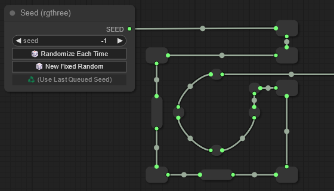

# rgthree's Comfy Nodes

These are a bunch of comfort and power nodes I created when messing around with Stable Diffusion. I made them for myself to make my workflow easier and cleaner. You're welcome to try them out, but do so at your own risk. Since I made them for myself, I didn't battle test them much outside of my specific use cases.

## Install

1. Install [ComfyUi](https://github.com/comfyanonymous/ComfyUI).
2. Clone this repo into `custom_modules`:
    ```
    cd ComfyUI/custom_nodes
    git clone https://github.com/rgthree/rgthree-comfy.git
    ```
3. Start up ComfyUI.

## Comfort Nodes

### Reroute (but, like, for real)

I wasn't a fan of how the original re-route wouldn't let me route in different directions (like, upwards, or to the left), so I made my own that can with each direction covered and pre-fixed small sizes.



### Seed

Finally, an intuitive seed control node for ComfyUI that works very much like Automatic1111's seed control.
- Set the seed value to "-1" to use a random seed every time
- Set any other number in there to use as a static/fixed seed
- Quick actions to randomize, or (re-)use the last queued seed.
- Images metadata will store the seed value _(so dragging an image in, will have the seed field already fixed to its seed)_.
- _Secret Features_: You can manually set the seed value to "-2" or "-3" to increment or decrement the last seed value. If there was not last seed value, it will randomly use on first.


### Context

Allows you to keep a current context of general flow properties, merging in new data. Similar to some other node suites "pipes" but easier merging, is more easily interoperable with standard nodes by both combining and exploding all in a single node.


### Display Int

Shows an int _after execution_.

### Lora Loader Stack

A simplified Lora Loader stack. Much like other suites, but more interoperable with standard inputs/outputs.

### Power Prompt

The power prompt lets you choose from your embeddings and lora tags. Use it as a replacement for a string primitive, outputting the raw text, or connect a CLIP to it, to output the conditioning. If you add &lt;lora> tags, you can connect a MODEL and it will load the loras, and output the model to use.


## Power Nodes

With the following nodes, you can make your ComfyUI experience more streamlined using the **Context Switch** to choose the first non-null **Context** input powered by the **Fast Muter** as a one-press dashboard of toggles to enable and disabled your workflows.


### Context Switch

_(In aqua blue above)_ Chooses the first non-null context.

### Fast Muter/Bypasser

_(In purple above)_ Add a collection of all connected nodes allowing a single-spot as a "dashboard" to quickly enable and disable nodes. Two distinct nodes; one for "Muting" connected nodes, and one for "Bypassing" connected nodes.

Also, you can use the **Node Collector** as UI-only virtual node that allows you to connect any number of nodes as an input, into a single output. As of right now, this is only useful for cleaning up noodles to the Muter node and **any other use will likely not work at all.**

<details>
<summary><big><b>A powerful combination: Using Context, Context Switch, & Fast Muter</b></big></summary>

1. Using the **Context Switch** feed context inputs in order of preference. In the workflow above, the `Upscale Out` context is first so, if that one is enabled, it will be chosen for the output. If not, the second input slot which comes from the context rerouted from above (before the Upscaler booth) will be chosen.

    - Notice the `Upscale Preview` is _after_ the `Upscale Out` context node, using the image from it instead of the image from the upscale `VAE Decoder`. This is on purpose so, when we disable the `Upscale Out` context, none of the Upscaler nodes will run, saving precious GPU cycles. If we had the preview hooked up directly to the `VAE Decoder` the upscaler would always run to generate the preview, even if we had the `Upscale Out` context node disabled.

2. We can now disable the `Upscale Out` context node by _muting_ it. Highlighting it and pressing `ctrl + m` will work. By doing so, it's output will be None, and it will not pass anthing onto the further nodes. In the diagram you can see the `Upscale Preview` is red, but that's OK; there are no actual errors to stop execution.

3. Now, let's hook it up to the `Fast Muter` node. `The Fast Muter` node works as dashboard by adding quick toggles for any connected node (ignoring reroutes). In the diagram, we have both the `Upscaler Out` context node, and the `Save File` context node hooked up. So, we can quickly enable and disable those.

    - The workflow seen here would be a common one where we can generate a handful of base previews cheaply with a random seed, and then choose one to upscale and save to disk.

4. Lastly, and optionally, you can see the `Node Collector`. Use it to clean up noodles if you want and connect it to the muter. You can connect anything to it, but doing so may break your workflow's execution.

</details>
